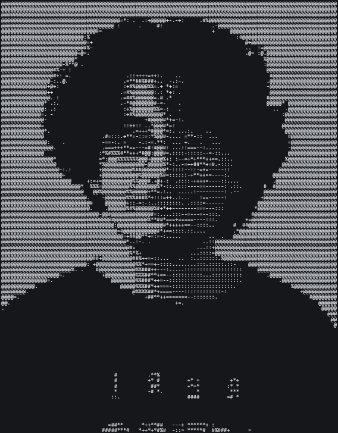

<pre>

Aykhan Isgandarzada
──────────────────────────────────────────────────────────────────────────────

OS...................... Windows 11, Linux, Android
Uptime................... <!--UPTIME-->19 years, 0 months, 11 days<!--/UPTIME-->
School.................. Holberton School, BEU
Focus................... Electronics, Programming
Currently Learning...... Python, JavaScript

Languages............... Python
........................ JavaScript (ES6)
........................ C
........................ HTML5
........................ CSS3
........................ SQL

Frameworks.............. Flask
Database................ MySQL
........................ SQLite

Tools................... Git
........................ Linux
........................ VS Code
........................ ArduinoIDE

Interests............... Open Source
........................ System Design
........................ Music
........................ Nature
........................ Magic

GitHub
──────────────────────────────────────────────────────────────────────────────

Username................ Isgenderx
Repositories............ Public Projects
Status.................. Depressed

Contact
──────────────────────────────────────────────────────────────────────────────

GitHub.................. https://github.com/Isgnderx
LinkedIn................ https://www.linkedin.com/in/aykhan-isgandarzada-aa8642331
Email................... ayxanisgenderzade999@gmail.com

</pre>

 

---

<h2>⚡ Tech Stack</h2>

---

## 📋 GitHub Summary

---

## 🔥 Contribution Streak

---

## 📈 Contribution Graph

---
